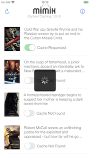

# Content Caching Gateway Setup for macOS.

## Prepare The Setup Files
Download the Content Caching Gateway Setup [zip file](https://github.com/mimikgit/cocoapod-MIMIKEdgeClientContentCache/blob/main/content-caching-gateway-setup-for-macOS.zip)

Unzip the file somewhere on your macOS system.

Enter the root directory of the unzipped folder in a terminal window. 

Follow the instructions below.


## Starting edgeEngine
Check if `.edge` or `downloads` folders already exists in the root of the setup folder. This would indicate a pre-existing setup as these folders get created the first time you run `start-edge.sh` and cache the first content. Delete them if you'd like to start the setup from scratch.
```
./start-edge.sh
```

# Configuring and Deploying edge microservice
Use visual studio `code` macOS app to open the `deployment.http` file.

Replace the `clientId` value with the one you got from mimik [developer portal console](https://developer.mimik.com/console/projects)

Replace the `developerIdToken` value with the one you got from mimik [developer portal console](https://developer.mimik.com/console/projects)

Start clicking on the `Send Request` buttons. One at a time, all 15 of them. Watch out for any errors in the response windows.

In the first response window you should see a `nodeId` value. Save it. Open `video-feed-demo.http` file. Replace the `nodeId` value with it.

In the third response window you should see a `access_token` value. Save it. Open `video-feed-demo.http` file. Replace the `edgeToken` value with it.


## Installing download-manager
```
cd agent/download-manager
npm i
```

## Installing webhoot-agent
```
cd agent/webhook-agent
npm i
```

## Configuring download manager script
```
open start-download.sh
```
Replace the `CLIENT_ID` value with the one you got from mimik [developer portal console](https://developer.mimik.com/console/projects)

## Starting download-manager script
```
./start-download.sh
```

## Configuring webhook script
```
open start-webhook.sh
```
Replace the `CLIENT_ID` value with the one you got from mimik [developer portal console](https://developer.mimik.com/console/projects)

Also modify the `MUPCOMINGFEED_BASE_URL` and `SHADOWFEED_BASE_URL` values to both use the same `clientId` part of their paths.

## Starting webhook.sh script
```
./start-webhook.sh
```

## Confirming setup
Confirm that `edgeEngine`, `download-manager` and `webhoot-agent` are all running in their own terminals 


## Content Caching Example application on Test Flight
A content caching example app showing the [MIMIKEdgeClientIdentity](https://github.com/mimikgit/cocoapod-MIMIKEdgeClientIdentity) library in action can be downloaded from this [Test Flight](https://testflight.apple.com/join/uLCPNxls) public link. You will need to open the link on an iOS device.

You can find out more about the example application in [README-Example-App-Test-Flight](https://github.com/mimikgit/cocoapod-MIMIKEdgeClientContentCache/blob/main/README-Example-App-Test-Flight.md)


## Running Content Caching Example Example Application
Now you are ready to start the iOS Content Caching example application.

When prompted on startup, paste in the same `developerIdToken` and `nodeId` values. 


Delete the application and install again if you are not prompted to paste in your developer id token and gateway node id on startup.

Say `OK` to allow the application to find and connect to remote devices.


Please give the application a few seconds on startup to synchronize the data and become ready.


Then you can tap on the cache toggle and see the content to get downloaded to your macOS gateway.




Once cached, the application will start playing the content from your macOS gateway directly.