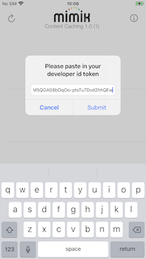
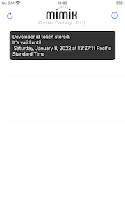
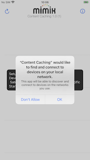

## Content Caching Example application on Test Flight
A content caching example app showing the MIMIKEdgeClientContentCache library in action can be downloaded from this [Test Flight](https://testflight.apple.com/join/uLCPNxls) public link.

Please note that in order to use the example application you will have setup a Content Caching Gateway as described here: [Requirements](#Requirements).

## Requirements
```
iOS 13.6+ device (simulators are not supported)

A working Content Caching Gateway.
```

## iOS Example Application Objectives

Use the Content Caching example application for iOS to experience the following:

1. gateway sidecar microservice cached content actions: list, list by media id, delete, add
2. playing a remote gateway video stream
3. edgeEngine client library integration
4. edgeEngine client library adapter drop in code
5. edgeEngine startup
6. authentication using developer id token
7. microservice deployment
8. edgeEngine shutdown
9. unauthentication
10. edgeEngine debug information

**You will need to finish the mimik developer account registration and developer id token steps below and come back here before being able to fully experience this example application.**

## Content Caching Gateway setup for macOS

Please see the Content Caching Gateway setup instructions for macOS [here](https://github.com/mimikgit/cocoapod-MIMIKEdgeClientContentCache/blob/main/README-Content-Caching-Gateway-Setup-macOS.md)

## mimik developer account registration
Create a mimik developer account and sign in to the mimik developer console at
```https://developer.mimik.com/console```

## mimik developer id token generation
Create a new example project while signed in to the mimik developer console.
```➕ Create New Project ```

Get the developer id token while having the new example project screen opened at the mimik developer console
```🗝 Get ID Token ```

## Running example application
Now you are ready to start the iOS Content Caching example application.

When prompted on startup, paste in the same `developerIdToken` and `nodeId` values. 





Delete the application and install again if you are not prompted to paste in your developer id token and gateway node id on startup.

Say `OK` to allow the application to find and connect to remote devices.



Please give the application a few seconds on startup to synchronize the data and become ready.


Then you can tap on the cache toggle and see the content to get downloaded to your macOS gateway.


Once cached, the application will start playing the content from your macOS gateway directly.